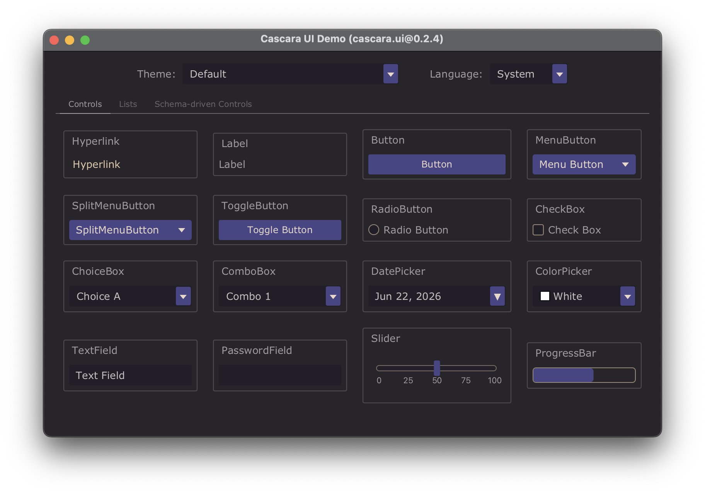
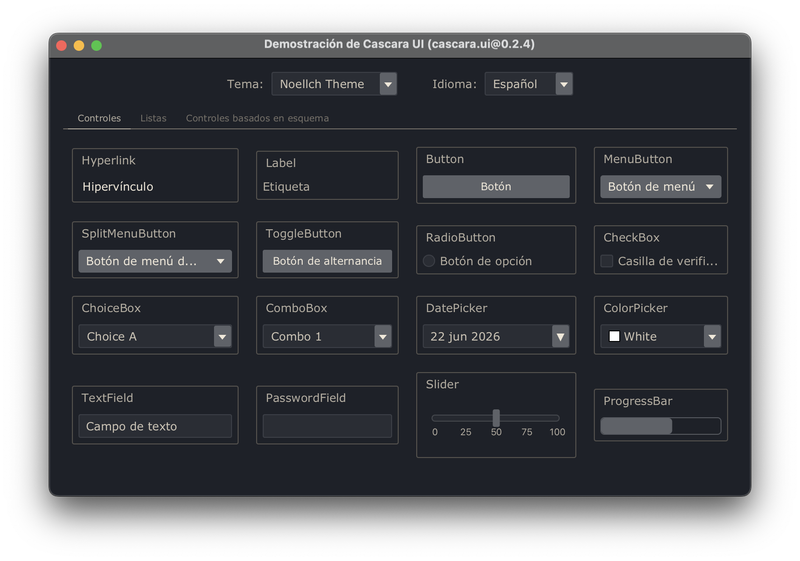
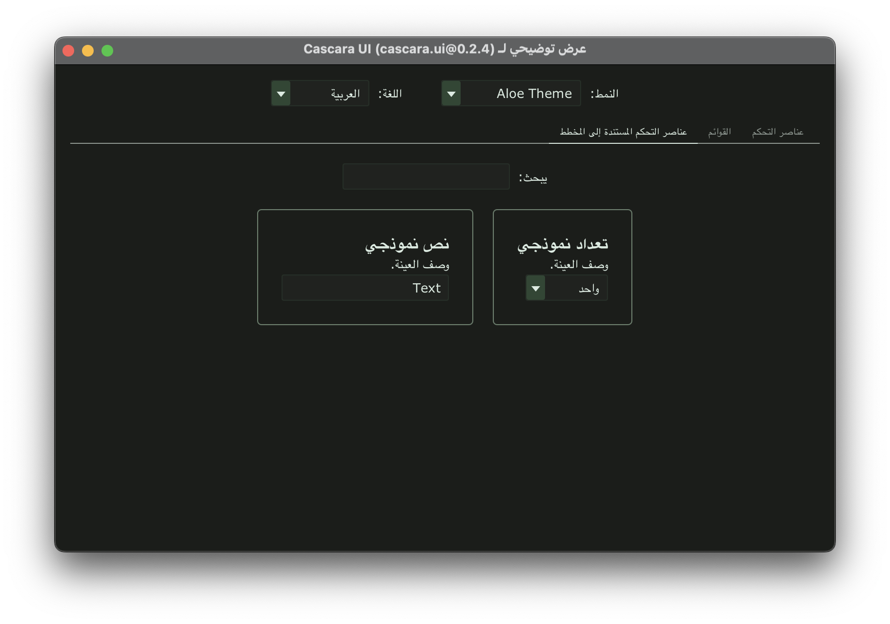

# Cascara Theme Engine

Theme support for JavaFX.

## Features

- Changing themes without restarting you application
- Importing Visual Studio Code themes
- JavaFX 24+

## Demonstration

These screenshots are of the **Cascara UI Demp app** which is available in the  [cascara-ui](https://github.com/qishr/cascara-ui) Github repository.


### Default *Cascara* Theme



### Noellch VS Code Theme

This screenshot is was taken with the language set to Spanish.

[View theme](https://marketplace.visualstudio.com/items?itemName=noellch.noellch) on visualstudio.com.



### Aloe VS Code Theme

This screenshot was taken with the language set to Arabic.

The dropdown list shows `Enum` values being translated automatically.

[View theme](https://marketplace.visualstudio.com/items?itemName=Lab829.aloe) on visualstudio.com.



## Installing VS Code Themes

To install a VS Code theme for the Cascara Theme Engine, copy the `.vsix` file into `~/.cascara/packages/`.

## Gradle

*Cascara UI* and its dependencies are available in the [Maven Central](https://mvnrepository.com/artifact/io.github.qishr) repository.

To use it in a Gradle project, add the following dependencies:

```groovy
dependencies {
    implementation "io.github.qishr:cascara-ui:0.2.3"

    // Transitive dependencies of cascara.ui...
    implementation "io.github.qishr:cascara-common:1.1.1"
    implementation "io.github.qishr:cascara-common-io:0.2.1"
    implementation "io.github.qishr:cascara-lang-json:0.2.2"
    implementation "io.github.qishr:cascara-lang-xml:0.2.2"
    implementation "io.github.qishr:cascara-lang-yaml:0.2.2"
    implementation "io.github.qishr:cascara-schema:0.2.2"
}
```

## Example Usage

This example uses the following Cascara classes to display a drop down list of installed themes and apply the chosen one to the scene:

- [ThemeEngine](https://qishr.github.io/javadoc/cascara.ui/theme/ThemeEngine/)
- [OptionChooser](https://qishr.github.io/javadoc/cascara.ui/control/OptionChooser/)

```java
Scene scene = new Scene(layout, 800, 500);

OptionChooser themeChooser = new OptionChooser(
    ThemeEngine.getThemeOptionProvider()
);

themeChooser.getSelectionModel().selectedItemProperty().addListener((obs, old, theme) -> {
    ThemeEngine.setTheme(theme);
});

ThemeEngine.applyTheme(scene);
```

## API Documentation

Javadoc is available [here](https://qishr.github.io/javadoc/cascara.ui/theme/ThemeEngine/).

