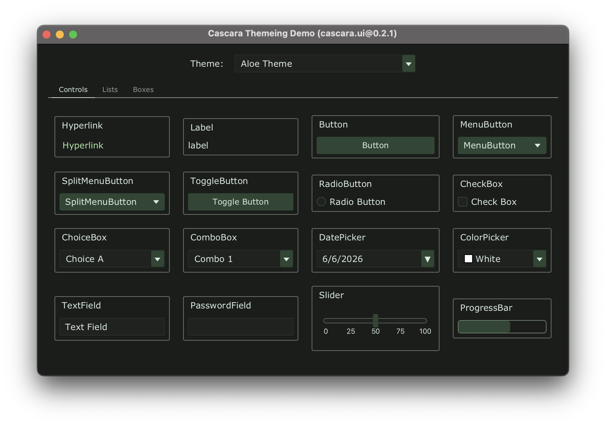

# Cascara Theme Engine

## Features

- Changing themes without restarting you application.
- Importing Visual Studio Code themes.

## Demonstration

These screenshots are of th Theming Example app which is available [on GitHub](https://github.com/qishr/cascara-example-theming).


### Default *Cascara* Theme


### Noellch VS Code Theme


### Aloe VS Code Theme



## Gradle

*Cascara UI* and its dependencies are available in the [Maven Central](https://mvnrepository.com/artifact/io.github.qishr) repository.

To use it in a Gradle project, add the following dependencies:

```groovy
dependencies {
    implementation "io.github.qishr:cascara-ui:0.2.1"

    // Transitive dependencies of cascara.ui...
    implementation "io.github.qishr:cascara-common:1.0.0"
    implementation "io.github.qishr:cascara-common-io:0.2.0"
    implementation "io.github.qishr:cascara-lang-yaml:0.2.0"
    implementation "io.github.qishr:cascara-schema:0.2.0"
}
```

## Adding VS Code Themes

To install a VS Code theme in Cascara, copy the `.vsix` file into `~/.cascara/packages/`.


